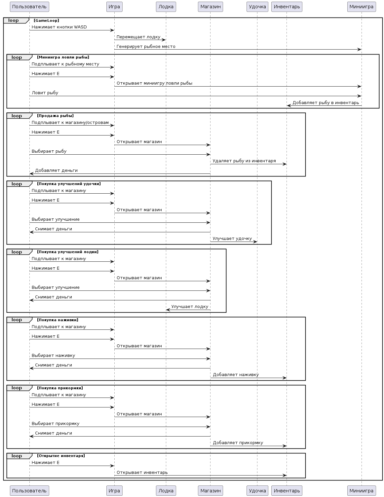

# Поведенческие модели

### Диаграммы состояний:

#### Миниигра ловли рыбы

* [Оффлайн файл](diagrams/behavior/fishing.puml)

Эта диаграмма состояний представляет собой мини-игру по рыбной ловле в игре. Начальное состояние - "Миниигра ловли рыбы". Пользователь может взаимодействовать с процессом, выполняя определенные действия.

Процесс начинается с состояния "Подплыть к рыбному месту", когда пользователь плывет к месту ловли рыбы. Нажатие кнопки E на клавиатуре приводит к переходу в состояние "Начало рыбалки", где пользователь начинает играть в мини-игру.

В состоянии "Игровой процесс" пользователь ловит рыбу, удерживая левую кнопку мыши (ЛКМ). Если пользователь успешно удерживает ЛКМ в течение определенного времени, он переходит в состояние "Засечка". В состоянии "Засечка" пользователь должен продолжать удерживать ЛКМ, чтобы вытащить рыбу. Если пользователь отпустит ЛКМ раньше, он переходит в состояние "Поражение".

Если пользователь успешно вытаскивает рыбу, он переходит в состояние "Победа". Если пользователь не может поймать рыбу, он переходит в состояние "Поражение".

#### Продажа рыбы

* [Оффлайн файл](diagrams/behavior/sellfish.puml)

Эта диаграмма состояний представляет собой процесс продажи рыбы в игре. Начальное состояние - "Продажа рыбы". Пользователь может взаимодействовать с процессом через подсказки, выбор рыбы и закрытие магазина.

Процесс начинается с состояния "Вывести подсказку", когда к магазину подплывает пользователь. Нажатие кнопки E на клавиатуре приводит к переходу в состояние "Вывести интерфейс магазина", где пользователь может просмотреть доступные варианты. Выбор опции продажи рыбы приводит к переходу в состояние "Выбор рыбы".

В состоянии "Выбор рыбы" пользователь может выбрать рыбу для продажи. Выбор рыбы приводит к переходу в состояние "Выбрать рыбу". В состоянии "Выбрать рыбу" отображается сообщение о продаже рыбы.

После продажи рыбы пользователь переходит в состояние "Выбор рыбы", чтобы решить, продать ли еще одну рыбу. Если у пользователя больше нет рыбы для продажи, он переходит в состояние "Вывести интерфейс магазина".

Из состояния "Вывести интерфейс магазина" можно также перейти в состояние "Закрыть магазин", нажав кнопку Esc на клавиатуре.

#### Покупка улучшений

* [Оффлайн файл](diagrams/behavior/buyupgrates.puml)

Эта диаграмма состояний представляет собой процесс покупки улучшений в игре. Начальное состояние - "Покупка улучшений". Пользователь может взаимодействовать с процессом через подсказки, выбор улучшений и закрытие магазина.

Процесс начинается с состояния "Вывести подсказку", когда к магазину подплывает пользователь. Нажатие кнопки E на клавиатуре приводит к переходу в состояние "Вывести интерфейс магазина", где пользователь может просмотреть доступные варианты. Выбор опции улучшения приводит к переходу в состояние "Выбор улучшения".

В состоянии "Выбор улучшения" пользователь может выбрать улучшение для лодки или удочки. Выбор опции приводит к переходу в соответствующее состояние, например, "Улучшение лодки" или "Улучшение удочки".

Затем процесс переходит в состояние "Проверка денег", чтобы проверить, достаточно ли у пользователя денег для покупки улучшения. Если денег достаточно, процесс переходит в состояние "Улучшение", где улучшение приобретается и выводится сообщение. Если денег недостаточно, процесс переходит в состояние "Вывести сообщение об ошибке".

Из состояния "Вывести интерфейс магазина" можно также перейти в состояние "Закрыть магазин", нажав кнопку Esc на клавиатуре.

#### Покупка наживки

* [Оффлайн файл](diagrams/behavior/buybait.puml)

Эта диаграмма состояний представляет собой процесс покупки наживки в игре. Начальное состояние - "Покупка наживки". Пользователь может взаимодействовать с процессом через подсказки, покупки и закрытие магазина.

Процесс начинается с состояния "Вывести подсказку", когда к магазину подплывает пользователь. Нажатие кнопки E на клавиатуре приводит к переходу в состояние "Вывести интерфейс магазина", где пользователь может просмотреть доступные варианты. Выбор опции покупки наживки приводит к переходу в состояние "Купить наживку".

В состоянии "Купить наживку" сначала проверяется наличие достаточного количества денег для покупки наживки. Если денег достаточно, наживка покупается, и пользователь переходит в состояние "Вывести сообщение о покупке". Если денег недостаточно, пользователь переходит в состояние "Вывести сообщение об ошибке".

Из состояния "Вывести интерфейс магазина" можно также перейти в состояние "Закрыть магазин", нажав кнопку Esc на клавиатуре.

#### Покупка прикорма

* [Оффлайн файл](diagrams/behavior/buylure.puml)

Эта диаграмма состояний представляет собой процесс покупки прикорма в игре. Начальное состояние - "Покупка прикорма". Пользователь может взаимодействовать с процессом через подсказки, покупки и закрытие магазина.

Процесс начинается с состояния "Вывести подсказку", когда к магазину подплывает пользователь. Нажатие кнопки E на клавиатуре приводит к переходу в состояние "Вывести интерфейс магазина", где пользователь может просмотреть доступные варианты. Выбор опции покупки прикорма приводит к переходу в состояние "Купить прикорм".

В состоянии "Купить прикорм" сначала проверяется наличие достаточного количества денег для покупки прикорма. Если денег достаточно, прикорм покупается, и пользователь переходит в состояние "Вывести сообщение о покупке". Если денег недостаточно, пользователь переходит в состояние "Вывести сообщение об ошибке".

Из состояния "Вывести интерфейс магазина" можно также перейти в состояние "Закрыть магазин", нажав кнопку Esc на клавиатуре.

### Диаграмма последовательности

* [Оффлайн файл](diagrams/behavior/sequence_diagram.puml)

1. Пользователь нажимает кнопки WASD для управления лодкой.
2. Игра перемещает лодку в соответствии с действиями пользователя.
3. Игра генерирует рыбу в игровом мире.
4. Пользователь нажимает кнопку E, чтобы открыть меню магазина.
5. Пользователь покупает наживку в магазине.
6. Магазин добавляет наживку в инвентарь пользователя.
7. Пользователь нажимает на рыбу, чтобы забросить удочку.
8. Игра перемещает крючок удочки в соответствии с действиями пользователя.
9. Пользователь удерживает левую кнопку мыши (ЛКМ), чтобы удерживать рыбу на крючке.
10. Игра удерживает рыбу на крючке, пока пользователь удерживает ЛКМ.
11. После того, как рыба поймана, пользователь может улучшить свою удочку или купить прикорм в магазине.
12. Пользователь может открыть свой инвентарь, нажав кнопку E.

Диаграмма показывает, как пользователь взаимодействует с игрой, чтобы ловить рыбу, улучшать свою удочку и покупать прикорм.