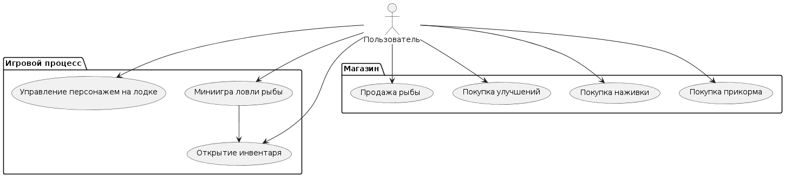
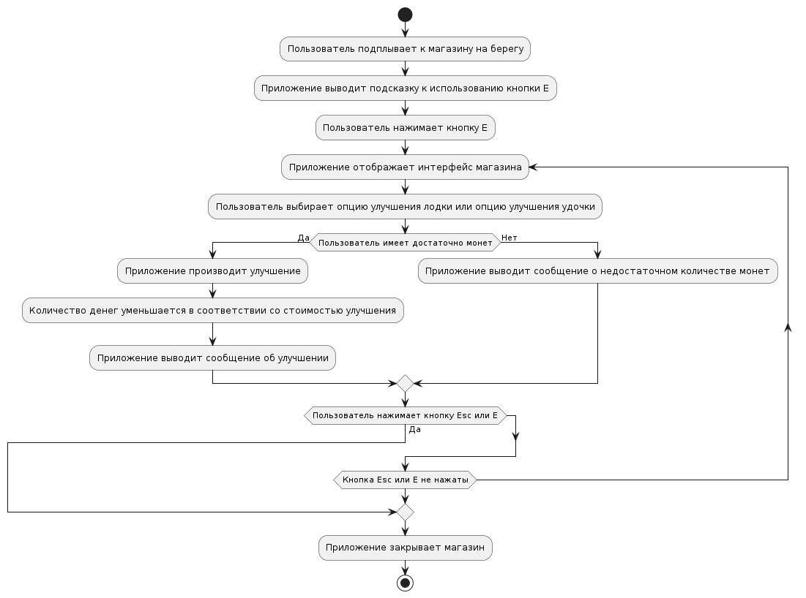

# Функциональные модели 
#### Диаграмма вариантов использования
* [Оффлайн файл](diagrams/functions/use_cases.puml)

### Управление персонажем на лодке

- Пользователь нажимает клавиши W, A, S, D.
- Приложение перемещает персонажа по морю.

### Миниигра ловли рыбы

- Пользователь подплывает к рыбному месту.
- Приложение выводит подсказку к использованию кнопки Е.
- Пользователь нажимает кнопку Е.
- Приложение отображает интерфейс миниигры.
- Пользователь использует мышь, чтобы перемещать курсор-крючок.
- Приложение перемещает спрайт рыбы.
- Пользователь зажимает ЛКМ на спрайте.
- Приложение удерживает спрайт.
- Пользователь удерживает ЛКМ до времени, установленного уровнем удочки.
- Приложение выводит сообщение о пойманной рыбе.
- Приложение закрывает миниигру.

* [Оффлайн файл](diagrams/functions/fishing.puml)

### Продажа рыбы

- Пользователь подплывает к магазину или острову.
- Приложение выводит подсказку к использованию кнопки Е.
- Пользователь нажимает кнопку Е.
- Приложение отображает интерфейс магазина.
- Пользователь выбирает опцию продажи рыбы.
- Приложение отображает меню выбора рыбы.
- Пользователь выбирает рыбу для продажи.
- Приложение выводит сообщение о продаже рыбы.
- Приложение закрывает меню выбора рыбы.
- Пользователь нажимает кнопку Esc или кнопку Е.
- Приложение закрывает магазин.

* [Оффлайн файл](diagrams/functions/sellfish.puml)

### Покупка улучшений

- Пользователь подплывает к магазину на берегу.
- Приложение выводит подсказку к использованию кнопки Е.
- Пользователь нажимает кнопку Е.
- Приложение отображает интерфейс магазина.
- Пользователь выбирает опцию улучшения лодки или удочки.
- Приложение производит улучшение (при наличии достаточного количества монет).
- Приложение выводит сообщение об улучшении.

* [Оффлайн файл](diagrams/functions/buyupgrates.puml)

### Покупка наживки

- Пользователь подплывает к магазину на берегу.
- Приложение выводит подсказку к использованию кнопки Е.
- Пользователь нажимает кнопку Е.
- Приложение отображает интерфейс магазина.
- Пользователь выбирает опцию покупки наживки.
- Приложение выводит сообщение о покупке (при наличии достаточного количества монет).
- Приложение добавляет наживку в инвентарь игрока.

* [Оффлайн файл](diagrams/functions/buybait.puml)

### Покупка прикорма

- Пользователь подплывает к магазину на берегу.
- Приложение выводит подсказку к использованию кнопки Е.
- Пользователь нажимает кнопку Е.
- Приложение отображает интерфейс магазина.
- Пользователь выбирает опцию покупки прикорма.
- Приложение выводит сообщение о покупке (при наличии достаточного количества монет).
- Приложение добавляет прикорм в инвентарь игрока.

* [Оффлайн файл](diagrams/functions/buylure.puml)

### Открытие инвентаря

- Пользователь нажимает кнопку Е.
- Приложение отображает инвентарь.
