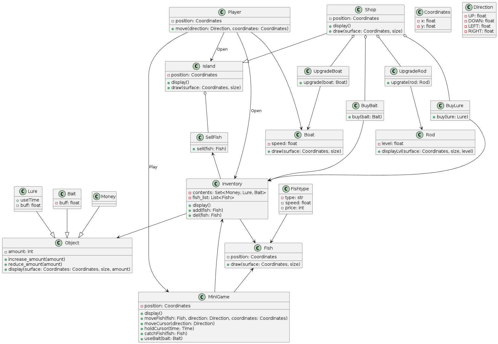

# Структурные модели
### Описание внутренней структуры приложения
* [Оффлайн файл](diagrams/struct/class_diagram.puml)

#### Классы:

- Player: Игрок в игре.
- Inventory: Инвентарь игрока, содержащий различные предметы.
- Object: Базовый класс для всех предметов в игре.
- Money: Класс, представляющий деньги в игре.
- Fish: Класс, представляющий рыбу в игре.
- Lure: Класс, представляющий приманки в игре.
- Bait: Класс, представляющий наживки в игре.
- Coordinates: Класс, представляющий координаты в игре.
- Direction: Класс, представляющий направления в игре.
- Boat: Класс, представляющий лодку в игре.
- Rod: Класс, представляющий удочку в игре.
- MiniGame: Класс, представляющий мини-игру в игре.
- Shop: Класс, представляющий магазин в игре.
- Island: Класс, представляющий остров в игре.
- SellFish: Класс, представляющий действие продажи рыбы.
- UpgradeBoat: Класс, представляющий действие улучшения лодки.
- UpgrateRod: Класс, представляющий действие улучшения удочки.
- BuyBait: Класс, представляющий действие покупки наживки.
- BuyLure: Класс, представляющий действие покупки приманки.

#### Отношения:

- Ассоциация: Связь один ко многим между классами Player и Inventory. Игрок может иметь несколько предметов в своем инвентаре.
- Агрегация: Связь часть-целое между классами Inventory и Object. Инвентарь содержит объекты.
- Наследование: Fish, Lure, Rod, Bait и Money наследуются от базового класса Object.
- Композиция: Связь часть-целое между классами Fish и MiniGame. Мини-игра содержит рыбу.
- Использование: Класс Player использует класс Boat.
- Взаимодействие: Класс Player взаимодействует с классом MiniGame.
- Зависимость: Класс MiniGame зависит от класса Inventory для хранения предметов.
- Открытие: Игрок может открывать классы Inventory, Shop и Island.
- Продажа: Класс SellFish принимает экземпляр класса Fish.
- Улучшение: Классы UpgradeBoat и UpgrateRod улучшают классы Boat и Rod соответственно.
- Покупка: Классы BuyBait и BuyLure покупают экземпляры классов Bait и Lure соответственно.